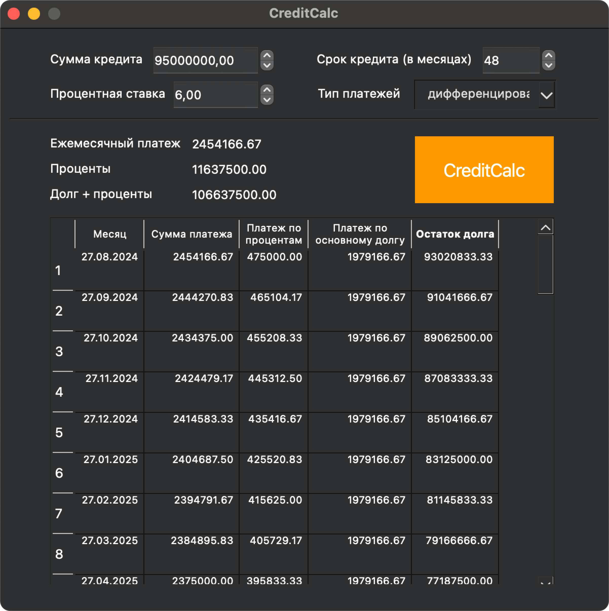

<div style="display: flex; align-items: center;">
  
  <span style="font-size: 24px; font-weight: bold; margin-left: 10px; line-height: 1;">SmartCalc v2.0</span>
</div>

## Introduction

SmartCalc v2.0 is an advanced calculator developed in C++ using the C++17 standard. The program is implemented using the MVC pattern and includes support for calculating arithmetic expressions with priorities, mathematical functions (sine, cosine, logarithm, etc.), the use of variable 𝑥, and plotting function graphs. It also includes credit and deposit calculators.


### Key Features

- **Programming Language**: C++ standard C++17
- **Project Structure**: The program code is located in the `src` folder
- **Coding Style**: Google Style was followed while writing the code
- **Namespace**: Classes are implemented within the `s21` namespace
- **Testing**: Full unit test coverage of modules related to expression calculation using the GTest library
- **Build**: Configured using Makefile with standard GNU program targets: `all`, `install`, `uninstall`, `clean`, `dvi`, `dist`, `tests`
- **Graphical Interface**: Implementation with a graphical user interface based on the Qt GUI library


### MVC Pattern

The MVC (Model-View-Controller) pattern divides the application into three components:

- **Model**: Stores data and business logic, performs calculations.
- **Controller**: Processes user actions and modifies the model.
- **View**: Displays data and provides an interface for user interaction.


### Implementation Principles

- No business logic code in the view code.
- No interface code in the controller and model.
- The controller is thin, acting as a linking element between the interface and the model.

This separation allows isolating business logic from the interface, simplifying changes and extending functionality.

## Additional Features

### Credit Calculator

A special "credit calculator" mode is provided:
**Input:** Total loan amount, term, interest rate, type (annuity, differentiated)
**Output:** Monthly payment, overpayment on the loan, total payment



### Deposit Calculator

A special "deposit yield calculator" mode is provided:

**Input:** Deposit amount, placement term, interest rate, tax rate, payment frequency, interest capitalization, list of replenishments, list of partial withdrawals
**Output:** Accrued interest, tax amount, amount on deposit at the end of the term


## Build Instructions

To build the program, use the provided Makefile:

- **Build the program:**
```bash
make all
```
- **Install the program** (a shortcut for launching will appear on the desktop):
```bash
make install
```
- **Uninstall the program:**
```bash
make uninstall
```
- **Удаление временных файлов сборки:**
```bash
make clean
```
- **Remove temporary build files:**
```bash
make dvi
```
