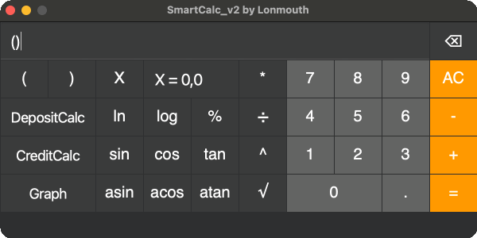
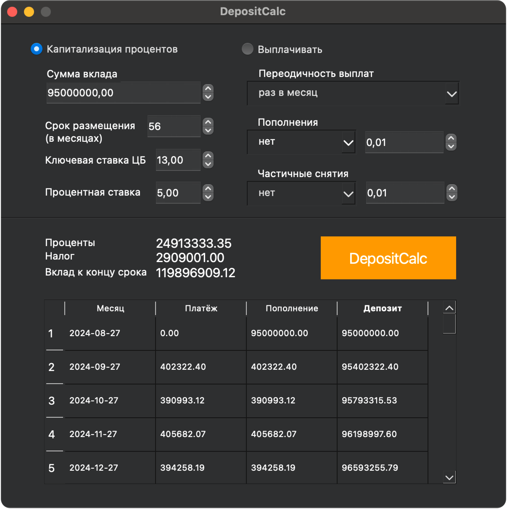

#  SmartCalc v2.0

## Введение

SmartCalc v2.0 — это расширенный калькулятор, разработанный на языке C++ стандарта C++17. Программа реализована с использованием паттерна MVC и включает поддержку вычисления арифметических выражений с учетом приоритетов, математических функций (синус, косинус, логарифм и т.д.), использование переменной \( x \) и построение графиков функций. Также реализованы кредитный и депозитный калькуляторы.



### Основные характеристики

- **Язык программирования**: C++ стандарта C++17
- **Структура проекта**: Код программы находится в папке `src`
- **Стиль кода**: При написании кода придерживался Google Style
- **Пространство имен**: Классы реализованы внутри пространства имен `s21`
- **Тестирование**: Полное покрытие unit-тестами модулей, связанных с вычислением выражений, с помощью библиотеки GTest
- **Сборка**: Настроена с помощью Makefile со стандартным набором целей для GNU-программ: `all`, `install`, `uninstall`, `clean`, `dvi`, `dist`, `tests`
- **Графический интерфейс**: Реализация с графическим пользовательским интерфейсом на базе GUI-библиотеки Qt


### Паттерн MVC

Паттерн MVC (Model-View-Controller, Модель-Представление-Контроллер) разделяет приложение на три компонента:

- **Модель**: хранит данные и бизнес-логику, выполняет вычисления.
- **Контроллер**: обрабатывает пользовательские действия и изменяет модель.
- **Представление**: отображает данные и предоставляет интерфейс для взаимодействия с пользователем.


### Принципы реализации

- Нет кода бизнес-логики в коде представлений.
- Нет кода интерфейса в контроллере и в модели.
- Контроллер тонкий, выполняет функцию связующего элемента между интерфейсом и моделью.

Это разделение позволяет изолировать бизнес-логику от интерфейса, что упрощает изменения и расширение функциональности.

## Дополнительные функции

### Кредитный калькулятор

Предусмотрен специальный режим "кредитный калькулятор":
**Вход:** общая сумма кредита, срок, процентная ставка, тип (аннуитетный, дифференцированный)
**Выход:** ежемесячный платеж, переплата по кредиту, общая выплата


### Депозитный калькулятор

Предусмотрен специальный режим "калькулятор доходности вкладов":

**Вход:** сумма вклада, срок размещения, процентная ставка, налоговая ставка, периодичность выплат, капитализация процентов, список пополнений, список частичных снятий
**Выход:** начисленные проценты, сумма налога, сумма на вкладе к концу срока



## Инструкции по сборке

Для сборки программы используйте предоставленный Makefile:

- **Сборка программы:**
```bash
make all
```
- **Установка программы** (на рабочем столе появится ярлык для запуска):
```bash
make install
```
- **Удаление программы:**
```bash
make uninstall
```
- **Удаление временных файлов сборки:**
```bash
make clean
```
- **Просмотр документации:**
```bash
make dvi
```
